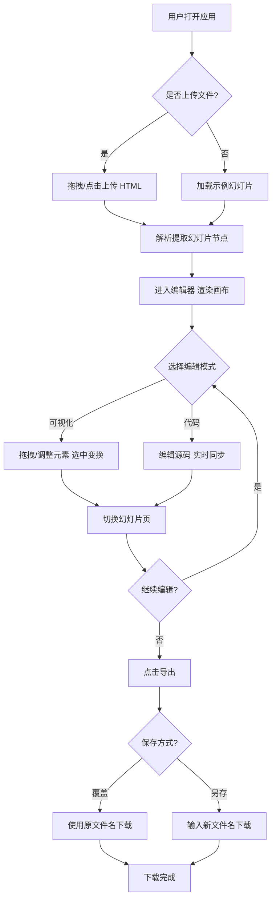

## 1. 产品概述

HTML 幻灯片可视化编辑器是一款基于 Web 的单页应用，让用户上传本地 HTML 格式的幻灯片文件后，可在画布中实时预览，并通过"代码编辑"与"可视化编辑"双模式对内容进行修改，最终支持覆盖保存或另存为新文件并下载。

- 解决问题：用户需要在不熟悉代码的情况下快速修改 HTML 幻灯片，同时为开发者保留直接编辑源码的能力
- 目标用户：需要制作/维护 HTML 演示文稿的讲师、产品经理、前端开发者
- 市场价值：以纯前端方案实现类 PPT 的所见即所得编辑，无需安装桌面软件，跨浏览器运行

## 2. 核心功能

### 2.2 功能模块

1. **上传页（首页）**：拖拽/点击上传 HTML 文件、示例文件入口、上传校验
2. **编辑器页**：双模式切换、幻灯片画布预览、可视化工具面板、元素属性面板、幻灯片缩略图导航
3. **导出页（弹层）**：覆盖保存、另存为新文件、下载预览

### 2.3 页面详情

| 页面名称 | 模块名称 | 功能描述 |
|-----------|-------------|---------------------|
| 上传页 | 拖拽上传区 | 支持拖拽与点击选择 .html 文件，校验文件类型与大小，解析后进入编辑器 |
| 上传页 | 示例入口 | 提供一份内置示例幻灯片，无需上传即可体验 |
| 编辑器页 | 模式切换 | 顶部提供"可视化编辑 / 代码编辑"切换，切换时数据双向同步 |
| 编辑器页 | 画布预览 | 以 iframe 渲染当前幻灯片，支持 16:9 适配缩放、上一页/下一页翻页 |
| 编辑器页 | 幻灯片导航 | 左侧缩略图列表，点击切换当前页，显示页码与总数 |
| 编辑器页 | 可视化工具面板 | 文本：拖拽移动、字号滑块、加粗/斜体/下划线、对齐、颜色；图片：上传插入、缩放、移动；视频：粘贴链接嵌入 YouTube/Bilibili |
| 编辑器页 | 元素属性面板 | 选中元素后显示其位置、尺寸、样式属性，支持数值微调 |
| 编辑器页 | 代码编辑器 | Monaco/CodeMirror 编辑 HTML 源码，保存后实时反映到画布 |
| 导出页 | 保存选项 | 覆盖原文件名保存 / 输入新文件名另存，确认后触发下载 |

## 3. 核心流程

用户打开应用 → 上传 HTML 文件 → 解析提取 `<section class="slide">` 幻灯片节点 → 进入编辑器展示首页 → 选择可视化/代码模式编辑 → 切换幻灯片页 → 编辑文本/图片/视频元素 → 点击导出 → 选择覆盖或另存 → 浏览器下载更新后的 HTML 文件。

## 4. 用户界面设计

### 4.1 设计风格

- 主色：深炭灰底 `#0E0E12` + 琥珀金强调 `#F5B642`，辅以冷灰中性色，营造专业暗色编辑器氛围
- 次色：青蓝 `#3DD6C8` 用于选中态/链接态点缀
- 按钮：圆角 8px，主操作实心琥珀金，次操作描边冷灰，危险操作红 `#E5484D`
- 字体：标题用 "Sora"（几何感强），正文用 "Inter Tight"，代码用 "JetBrains Mono"，画布内幻灯片保留其原字体
- 布局：左侧缩略图栏 + 中央画布舞台 + 右侧属性面板，顶部工具栏，桌面优先三栏式
- 图标：线性 1.5px 描边图标（Lucide 风格）

### 4.2 页面设计概述

| 页面名称 | 模块名称 | UI 元素 |
|-----------|-------------|-------------|
| 上传页 | 拖拽上传区 | 居中虚线大圆角卡片，拖拽悬浮态发光，琥珀金渐变背景纹理，主标题 Sora 600 |
| 上传页 | 示例入口 | 卡片右下角文字链按钮，悬停下划线动画 |
| 编辑器页 | 顶部工具栏 | 左 Logo+文件名，中模式切换胶囊按钮，右撤销/重做/导出按钮 |
| 编辑器页 | 左缩略图栏 | 240px 宽，垂直滚动卡片，当前页琥珀金左边框，页码徽章 |
| 编辑器页 | 中央画布 | 16:9 舞台居中，缩放控制，元素选中显示青蓝虚线框+8 个手柄 |
| 编辑器页 | 右属性面板 | 320px 宽，分组卡片：变换/文字/填充/边框，数值输入+滑块 |
| 编辑器页 | 代码编辑器 | 全宽 Monaco，暗色主题，行号，语法高亮 |
| 导出弹层 | 保存选项 | 模态卡片，单选覆盖/另存，文件名输入框，主按钮下载 |

### 4.3 响应式

桌面优先（≥1280px 三栏完整布局），平板（768-1279px 折叠缩略图为抽屉），移动端仅支持上传预览与代码查看，可视化编辑需桌面交互。

### 4.4 3D 场景指引

不适用（纯 2D 编辑器应用）。
