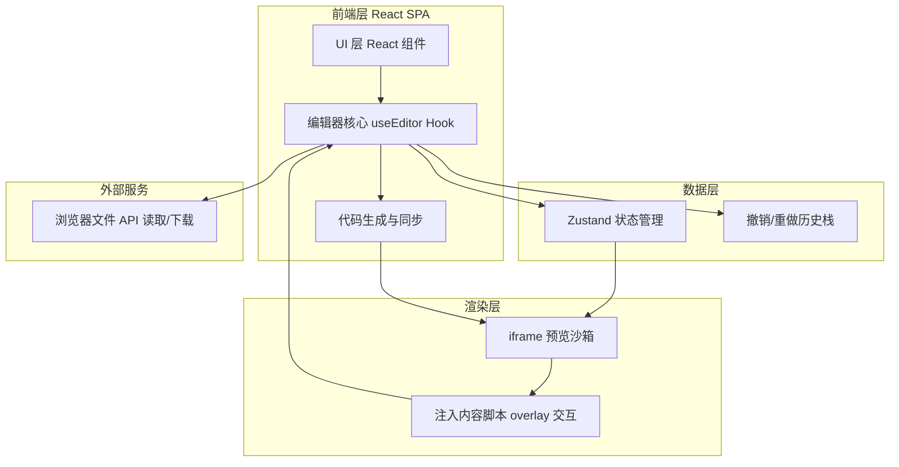

## 1. 架构设计



## 2. 技术说明

- 前端：React@18 + TypeScript + Vite
- 样式：TailwindCSS@3 + CSS 变量主题
- 状态管理：Zustand（幻灯片树、选中元素、历史栈）
- 代码编辑器：Monaco Editor（@monaco-editor/react）
- 渲染沙箱：iframe srcdoc 注入 + postMessage 通信 + 内容脚本实现元素选中/拖拽/缩放
- 初始化工具：vite-init（react-ts 模板）
- 后端：无（纯前端，文件通过浏览器 File API 读取与 Blob 下载）
- 数据库：无（运行时内存状态，可选 localStorage 暂存最近文件名）

## 3. 路由定义

| 路由 | 用途 |
|-------|---------|
| / | 上传页：拖拽上传 HTML 或进入示例 |
| /editor | 编辑器页：双模式编辑、画布预览、导出 |

## 4. API 定义

无后端 API。前端模块间通过 Zustand store 与 iframe postMessage 通信：

- `parseSlides(html: string): Slide[]` 解析 HTML 提取 `.slide` 节点
- `serializeSlides(slides: Slide[]): string` 序列化为完整 HTML 文档
- `postMessage` 协议：`{type:'select'|'drag'|'resize'|'style'|'dblclick', payload}` 主框架↔iframe 双向

## 5. 服务端架构图

不适用（纯前端应用，无后端）。

## 6. 数据模型

### 6.1 数据模型定义

```mermaid
erDiagram
    Document ||--o{ Slide : contains
    Slide ||--o{ Element : contains
    Element ||--o{ Style : has
    Document {
        string filename
        string rawHtml
        Slide[] slides
    }
    Slide {
        string id
        number index
        string html
        Element[] elements
    }
    Element {
        string id
        string type
        string tag
        string content
        Style style
    }
    Style {
        number x
        number y
        number width
        number height
        number fontSize
        string color
        string background
    }
```

### 6.2 数据定义语言

运行时数据结构（TypeScript 类型，非 SQL DDL）：

```typescript
interface SlideDocument {
  filename: string;
  rawHtml: string;
  head: string;
  slides: SlideNode[];
}
interface SlideNode {
  id: string;
  index: number;
  innerHTML: string;
  elements: EditableElement[];
}
interface EditableElement {
  id: string;
  type: 'text' | 'image' | 'video' | 'shape';
  tag: string;
  content: string;
  style: ElementStyle;
}
interface ElementStyle {
  x: number; y: number;
  width: number; height: number;
  fontSize?: number;
  fontWeight?: string;
  color?: string;
  background?: string;
  textAlign?: string;
}
```

## 7. 关键技术决策

1. **iframe 沙箱渲染**：用 `srcdoc` 渲染幻灯片 HTML，注入 overlay 脚本实现元素选中与变换，避免污染主应用 DOM。
2. **postMessage 双向通信**：主框架发送编辑指令，iframe 回传选中/拖拽事件，保证安全与解耦。
3. **DOM 操作而非 Canvas**：幻灯片本身是 HTML，使用 DOM + overlay 控制器实现拖拽/缩放，保留可访问性与文本可编辑性。
4. **视频嵌入**：YouTube 用 `https://www.youtube.com/embed/{id}`，Bilibili 用 `//player.bilibili.com/player.html?bvid={id}`，统一转为 iframe 嵌入。
5. **导出**：将编辑后的 DOM 序列化为完整 HTML 文档字符串，通过 `Blob` + `URL.createObjectURL` 触发下载。
